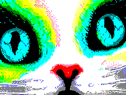
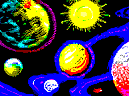
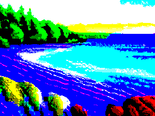
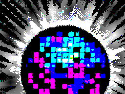

# ZX-Spectrum Art Generation with Stable Diffusion

Welcome to my ZX-Spectrum art generation project! Stable diffusion is a state-of-the-art AI technique that can generate images based on textual descriptions. In this project, I have combined it with a ZX Spectrum style prompt generator to create ZX Spectrum inspired images.

The script takes a text description of the ZX Spectrum scene and generates an image based on the provided description. Some examples of the generated images are shown below:

Example 1: A cute cat

Example 2: A Solar system

Example 3: A sea shore 

Example 4: A disco ball!

This project is for entertainment purposes only and should not be used for any commercial or illegal purposes. The generated images are not endorsed by or affiliated with any copyright holders, and the user is solely responsible for any usage that infringes upon copyright laws.